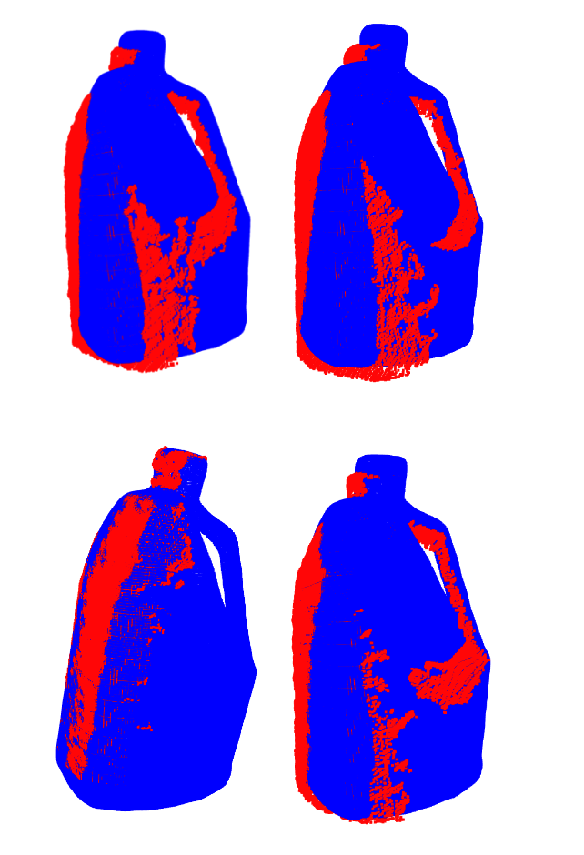

# Iterative Closest Point (ICP) Algorithm

## Overview

This repository contains the implementation of the Iterative Closest Point (ICP) algorithm. ICP is an iterative method to minimize the difference between two point clouds through a series of transformation updates. It is commonly used in various applications such as registration, alignment, and mapping.

## Features

    - Point Cloud Association:** Associates points between source and target point clouds using a nearest neighbor search.
    
    - Iterative Optimization:** Optimizes the transformation parameters iteratively to minimize the distance between corresponding points.
   
    - Robustness:** Handles noisy data and partial overlaps between point clouds.
  
## Sample Output



## Dependencies

    - numpy
    - scipy

## Installation

    No specific installation is required beyond the dependencies. You can directly use the provided Python script.

## Usage

### Running the Algorithm:

    1. Ensure you have the required dependencies installed.
    2. Provide source and target point clouds as numpy arrays.
    3. Call the `icp` function, passing the source and target point clouds.
    4. Optionally, specify initial transformation parameters `R_0` and `p_0`, maximum iterations, and other parameters.

### Sample Code:

```python
from icp import icp

# Load source and target point clouds
source_pc = ... #3D numpy array of shape (N, Num points)
target_pc = ... #3D numpy array of shape (M, Num points)
# Run ICP
transformation_matrix = icp(source_pc, target_pc)

# Visualize the result or use the transformation matrix for further processing